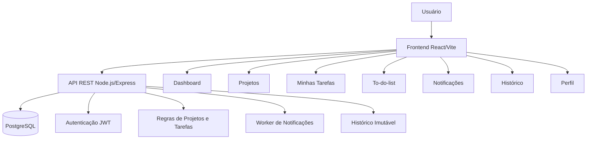
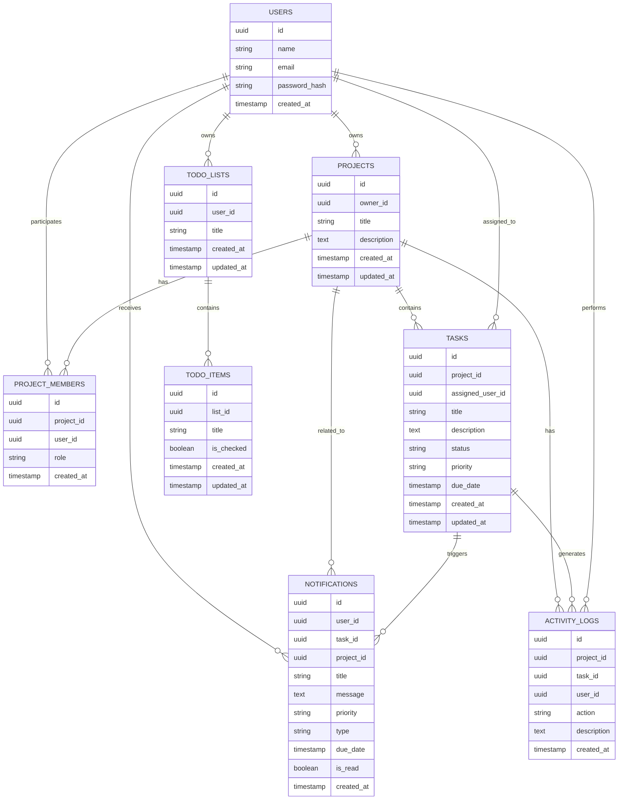

# TaskFlow


[](https://sonarcloud.io/summary/new_code?id=sandykmaciel_Projeto-Integrador)
[](https://sonarcloud.io/summary/new_code?id=sandykmaciel_Projeto-Integrador)

Sistema web para gerenciamento de tarefas pessoais, projetos, checklists rápidos, notificações e acompanhamento de produtividade.

O projeto foi desenvolvido para a disciplina de Projeto Integrador, com foco em organização pessoal e colaboração em tarefas, utilizando autenticação, banco de dados relacional, frontend moderno, backend em API REST, conteinerização, pipeline de integração contínua e análise de qualidade com SonarCloud.

## Links do projeto

Repositório: https://github.com/sandykmaciel/Projeto-Integrador

SonarCloud: https://sonarcloud.io/summary/new_code?id=sandykmaciel_Projeto-Integrador

Deploy: A definir após publicação da versão final

## Objetivo do produto

O TaskFlow tem como objetivo oferecer uma plataforma simples e organizada para gerenciamento de tarefas pessoais e em equipe.

A aplicação permite que o usuário:

* Crie uma conta;
* Faça login com autenticação;
* Recupere e redefina senha;
* Gerencie projetos;
* Crie tarefas vinculadas a projetos;
* Acompanhe progresso de projetos;
* Visualize tarefas atribuídas ao usuário;
* Consulte dashboard com gráficos de completude;
* Priorize tarefas por prazo e urgência;
* Receba notificações de tarefas próximas do vencimento;
* Consulte histórico de alterações;
* Crie listas rápidas independentes de projetos;
* Acesse configurações básicas do perfil.

## Contexto das sprints

### Sprint 1

Na primeira sprint, o foco foi implementar a base do sistema:

* Cadastro de usuários;
* Login e autenticação com JWT;
* Recuperação de senha;
* Redefinição de senha;
* Layout autenticado;
* Sidebar;
* Navbar;
* Rotas internas protegidas.

### Sprint 2

Na segunda sprint, o foco foi o módulo de projetos:

* Projetos em formato de cards;
* Criação de projeto;
* Criação de projeto com tarefa inicial;
* Membros de projeto;
* Progresso de projetos;
* Página interna de detalhes do projeto;
* Criação, edição, conclusão e exclusão de tarefas;
* Edição e exclusão de projetos.

### Sprint 3

Na terceira sprint, o foco foi completar os módulos globais da aplicação:

* Notificações;
* Histórico;
* Dashboard com gráficos;
* Tabela de prioridade de prazos;
* Tela Minhas tarefas;
* To-do-list independente de projetos;
* Configurações de perfil;
* Melhorias de fluxo e correções visuais;
* Preparação final de documentação, qualidade e deploy.

## Integrantes e responsabilidades

* Kaique Inácio Salvador
  Responsável pelo desenvolvimento do card de sidebar e navbar fixa, incluindo layout autenticado, navegação lateral, menu de perfil e rotas internas, também ficou responsável pelos cards relacionados às funcionalidades globais da aplicação, incluindo notificações, histórico, dashboard, prioridade de prazos, minhas tarefas e to-do-list.

* Luiz Carlos de Paiva Silva
  Responsável pelo desenvolvimento dos cards de cadastro, login/autenticação e módulo de projetos, incluindo backend, frontend, validações, JWT, recuperação de senha, estrutura de banco, integração com API, Docker, pipeline, testes, SonarCloud, cards de projetos, criação de projeto com tarefa inicial e página interna de detalhes do projeto. Também atuou em ajustes finais, documentação, correções de fluxo e preparação do projeto para entrega.

* Sandy Karolina Maciel
  Product Owner do projeto, responsável pela organização das demandas, acompanhamento dos critérios de aceitação, validação das entregas e realização da maioria das revisões de código nos Pull Requests.

## Tecnologias utilizadas

### Frontend

* React
* Vite
* Axios
* React Router DOM
* CSS

### Backend

* Node.js
* Express
* PostgreSQL
* BcryptJS
* JSON Web Token
* Dotenv
* CORS
* Jest

### Banco de dados

* PostgreSQL

### Conteinerização

* Docker
* Docker Compose

### Qualidade e CI/CD

* GitHub Actions
* SonarCloud
* Jest Coverage
* Quality Gate
* Pull Requests com revisão obrigatória

### Versionamento e processo

* Git
* GitHub
* GitHub Projects
* Branch protection
* Commits semânticos

## Arquitetura da aplicação

A aplicação foi estruturada em três camadas principais:

```txt
Frontend React
     |
     | Requisições HTTP com Axios
     v
Backend Node.js/Express
     |
     | Queries SQL
     v
Banco PostgreSQL
```

O frontend é responsável pelas telas, formulários, navegação e consumo da API.

O backend centraliza as regras de negócio, autenticação, validações e comunicação com o banco de dados.

O banco PostgreSQL persiste usuários, projetos, tarefas, membros, notificações, histórico e listas rápidas.

## Diagrama de arquitetura



## Diagrama de entidades



## Decisões técnicas

### React com Vite

O frontend foi desenvolvido com React e Vite pela facilidade de configuração, velocidade no ambiente de desenvolvimento e boa integração com projetos modernos em JavaScript.

### Backend com Node.js e Express

O backend foi implementado com Node.js e Express por permitir uma API REST simples, organizada e de fácil manutenção para os módulos da aplicação.

### PostgreSQL

O PostgreSQL foi escolhido por ser um banco relacional robusto e adequado para representar entidades com relacionamentos, como usuários, projetos, membros, tarefas, notificações e listas.

### JWT para autenticação

A autenticação utiliza JSON Web Token. Após o login, o token é armazenado no frontend e enviado nas requisições protegidas por meio do cabeçalho `Authorization`.

### Docker Compose

O Docker Compose foi utilizado para simplificar a execução local, permitindo subir banco, backend e frontend com um único comando.

### GitHub Actions

O pipeline executa testes, cobertura, build do frontend e análise no SonarCloud a cada Pull Request ou atualização na branch principal.

### SonarCloud

O SonarCloud foi utilizado para monitorar qualidade, duplicações, cobertura, issues críticas e Quality Gate.

### Histórico imutável

O histórico de alterações foi criado sem rotas de edição ou exclusão, garantindo que registros de alterações de tarefas permaneçam preservados.

### Notificações assíncronas

As notificações de prazo são geradas por um worker em segundo plano no backend. Esse worker verifica tarefas não concluídas com vencimento próximo e cria notificações para o usuário responsável.

### To-do-list independente de projetos

As listas rápidas foram separadas das tarefas de projeto para atender atividades simples, como lista de compras, lembretes e rotinas domésticas, sem necessidade de prazo, descrição ou responsável.

## Funcionalidades implementadas

## Cadastro de usuário

* Tela de cadastro;
* Campos de nome, email e senha;
* Checkbox de aceite dos Termos de Privacidade;
* Validação de campos obrigatórios;
* Validação de email;
* Validação de senha com no mínimo 4 caracteres e pelo menos uma letra maiúscula;
* Validação de email único;
* Armazenamento de senha com hash;
* Redirecionamento para login após cadastro.

## Login e autenticação

* Tela de login;
* Login com email e senha;
* Geração de token JWT;
* Armazenamento do token no frontend;
* Redirecionamento para dashboard após login;
* Mensagem para email inválido;
* Mensagem para senha incorreta;
* Bloqueio temporário após 5 tentativas consecutivas malsucedidas;
* Recuperação de senha;
* Redefinição de senha com token temporário.

## Sidebar e navbar fixa

* Layout autenticado para telas internas;
* Sidebar com navegação para Dashboard, Projetos, Tasks e To-do-list;
* Destaque visual do módulo ativo;
* Navbar fixa;
* Menu expansível de perfil;
* Opções de Configurações do perfil, Notificações, Histórico e Logout;
* Logout removendo os dados de autenticação do frontend;
* Redirecionamentos para rotas alternativas.

## Configurações de perfil

* Tela `/perfil`;
* Exibição do nome e email do usuário;
* Card de dados pessoais;
* Card de conta;
* Card de preferências;
* Card de segurança;
* Botão para copiar email;
* Feedback visual após copiar email.

## Projetos em formato de cards

* Estrutura de banco para projetos;
* Estrutura de banco para membros de projetos;
* Estrutura de tarefas vinculadas a projetos;
* Endpoints protegidos por JWT para listar, criar, editar e excluir projetos;
* Tela de projetos consumindo a API;
* Listagem de projetos em formato de cards;
* Exibição do título do projeto;
* Exibição da descrição do projeto;
* Barra de progresso calculada com base nas tarefas vinculadas;
* Exibição de membros do projeto em formato de avatares;
* Ações de editar e excluir projeto;
* Modal de edição de projeto;
* Modal de confirmação antes da exclusão;
* Aviso de que tarefas vinculadas também serão removidas ao excluir um projeto.

## Criação de projeto com tarefa inicial

* Modal de criação aberta a partir da tela de Projetos;
* Campo de nome do projeto;
* Campo de descrição do projeto;
* Busca e seleção de membros cadastrados;
* Exibição visual dos membros selecionados em formato de avatar;
* Usuário logado adicionado como membro padrão;
* Formulário de criação da tarefa inicial;
* Campo de título da tarefa;
* Campo de descrição da tarefa;
* Campo de data final;
* Validação para impedir data final anterior à data atual;
* Campo de responsável preenchido por padrão com o usuário logado;
* Possibilidade de alterar o responsável para outro membro do projeto;
* Campo de prioridade da tarefa;
* Tabela de pré-visualização da tarefa inicial;
* Filtro de busca em tempo real na tabela;
* Criação do projeto e da tarefa inicial em um único fluxo;
* Atualização automática da listagem de projetos após salvar.

## Página interna de detalhes do projeto

* Acesso à página interna ao clicar em um card de projeto;
* Rota interna `/projetos/:id`;
* Exibição do nome do projeto em destaque;
* Exibição da descrição do projeto;
* Edição do projeto diretamente pela tela de detalhes;
* Exibição do total de tarefas vinculadas;
* Exibição do total de tarefas concluídas;
* Exibição do progresso atualizado do projeto;
* Exibição dos membros vinculados ao projeto;
* Tabela com tarefas específicas do projeto selecionado;
* Exibição de título, descrição, prioridade, responsável, data final e ações;
* Filtro de busca por tarefa, descrição ou responsável;
* Checkbox para marcar tarefa como concluída;
* Texto riscado para tarefas concluídas;
* Atualização do progresso ao concluir ou reabrir tarefas;
* Painel lateral para criação de nova tarefa;
* Painel lateral para edição de tarefa existente;
* Exclusão de tarefas vinculadas ao projeto;
* Botão de exclusão do projeto completo;
* Modal de confirmação antes da exclusão do projeto;
* Redirecionamento para `/projetos` após excluir o projeto.

## Dashboard

* Tela `/dashboard`;
* Cards de resumo geral;
* Total de tarefas;
* Total de projetos;
* Total de prazos pendentes;
* Gráfico circular de tarefas completas vs pendentes;
* Gráfico circular de projetos completos vs pendentes;
* Tabela de prioridade de prazos;
* Ordenação por data final;
* Ordenação por prioridade;
* Listagem apenas de tarefas pendentes na tabela de prioridade.

## Minhas tarefas

* Tela `/tasks`;
* Listagem das tarefas atribuídas ao usuário logado;
* Tarefas de todos os projetos acessíveis;
* Tabela com status, tarefa, projeto, prioridade e data final;
* Checkbox para concluir ou reabrir tarefa;
* Texto riscado para tarefas concluídas;
* Tarefas concluídas permanecem na lista;
* Tarefas concluídas são enviadas para o final da listagem;
* Busca em tempo real por nome da tarefa ou projeto;
* Ordenação por data final;
* Ordenação por prioridade;
* Ordenação por ordem alfabética;
* Atualização do progresso do projeto após alteração de status.

## Notificações

* Tela `/notificacoes`;
* Central de notificações;
* Notificações geradas automaticamente por rotina assíncrona;
* Alertas para tarefas próximas do vencimento ou atrasadas;
* Exibição de prioridade;
* Exibição de projeto e tarefa relacionados;
* Exibição de tempo restante;
* Filtros por todas, lidas e não lidas;
* Ação para marcar notificação como lida.

## Histórico

* Tela `/historico`;
* Linha do tempo de alterações;
* Registro de criação de tarefas;
* Registro de edição de tarefas;
* Registro de alteração de status;
* Registro de exclusão de tarefas;
* Exibição de responsável;
* Exibição de ação realizada;
* Exibição de projeto relacionado;
* Exibição de data e hora;
* Busca por responsável, projeto, tarefa ou ação;
* Histórico sem rotas de edição ou exclusão.

## To-do-list

* Tela `/todo-list`;
* Criação de listas rápidas independentes de projetos;
* Cards para cada lista criada;
* Adição de itens simples dentro de cada lista;
* Itens sem data final;
* Itens sem descrição detalhada;
* Checkbox de marcação rápida;
* Remoção individual de itens;
* Remoção da lista inteira;
* Dados salvos no perfil do usuário;
* Persistência após atualizar a página.

## Estrutura do projeto

```txt
Projeto-Integrador/
│
├── .github/
│   └── workflows/
│       └── ci.yml
│
├── backend/
│   ├── src/
│   │   ├── database/
│   │   │   ├── connection.js
│   │   │   └── migrate.js
│   │   ├── middlewares/
│   │   │   └── auth.middleware.js
│   │   ├── routes/
│   │   │   ├── auth.routes.js
│   │   │   ├── dashboard.routes.js
│   │   │   ├── history.routes.js
│   │   │   ├── notifications.routes.js
│   │   │   ├── projects.routes.js
│   │   │   ├── tasks.routes.js
│   │   │   ├── todo.routes.js
│   │   │   └── users.routes.js
│   │   ├── services/
│   │   │   └── notificationWorker.js
│   │   ├── utils/
│   │   │   └── validators.js
│   │   └── server.js
│   │
│   ├── tests/
│   │   ├── notificationWorker.test.js
│   │   └── validators.test.js
│   │
│   ├── .env.example
│   ├── package.json
│   └── package-lock.json
│
├── docs/
│   └── retrospectivas/
│       ├── sprint1.md
│       └── sprint2.md
│
├── frontend/
│   ├── src/
│   │   ├── components/
│   │   │   ├── Sidebar.jsx
│   │   │   └── TopNavbar.jsx
│   │   ├── layouts/
│   │   │   └── AuthenticatedLayout.jsx
│   │   ├── pages/
│   │   │   ├── Dashboard.jsx
│   │   │   ├── ForgotPassword.jsx
│   │   │   ├── History.jsx
│   │   │   ├── Login.jsx
│   │   │   ├── Notifications.jsx
│   │   │   ├── ProfileSettings.jsx
│   │   │   ├── ProjectDetails.jsx
│   │   │   ├── Projects.jsx
│   │   │   ├── Register.jsx
│   │   │   ├── ResetPassword.jsx
│   │   │   ├── Tasks.jsx
│   │   │   └── TodoList.jsx
│   │   ├── services/
│   │   │   └── api.js
│   │   ├── App.jsx
│   │   ├── main.jsx
│   │   └── index.css
│   │
│   ├── .env.example
│   ├── index.html
│   ├── vite.config.js
│   ├── package.json
│   └── package-lock.json
│
├── Dockerfile
├── docker-compose.yml
├── sonar-project.properties
├── .gitignore
└── README.md
```

## Pré-requisitos

Antes de executar o projeto localmente, é necessário ter instalado:

* Git
* Node.js
* npm
* Docker
* Docker Compose

## Como clonar o projeto

```bash
git clone https://github.com/sandykmaciel/Projeto-Integrador.git
cd Projeto-Integrador
```

## Como executar com Docker Compose

A aplicação pode ser executada com Docker Compose, subindo banco de dados, backend e frontend.

Na raiz do projeto, execute:

```bash
docker compose up --build
```

Esse comando inicia:

```txt
PostgreSQL
Backend Node.js/Express
Frontend React/Vite
```

Após a inicialização, os serviços ficam disponíveis em:

```txt
Frontend: http://localhost:5173
Backend: http://localhost:3333
Health check: http://localhost:3333/health
```

Para parar os containers:

```bash
docker compose down
```

Caso existam containers antigos do projeto ocupando portas, execute:

```bash
docker compose down --remove-orphans
```

## Como configurar e executar manualmente

Também é possível executar o projeto manualmente, sem Docker Compose completo.

### Banco de dados

Na raiz do projeto, execute:

```bash
docker compose up database -d
```

Configurações do banco:

```txt
Host: localhost
Porta: 5432
Usuário: task_user
Senha: task_password
Banco: task_manager
```

### Backend

Acesse a pasta do backend:

```bash
cd backend
```

Instale as dependências:

```bash
npm install
```

Crie o arquivo `.env` a partir do exemplo:

```bash
cp .env.example .env
```

Execute a migration:

```bash
npm run migrate
```

Resultado esperado:

```txt
Migrations executed successfully.
```

Inicie o backend:

```bash
npm run dev
```

O backend ficará disponível em:

```txt
http://localhost:3333
```

Para testar se a API está rodando:

```txt
http://localhost:3333/health
```

### Frontend

Em outro terminal, acesse a pasta do frontend:

```bash
cd frontend
```

Instale as dependências:

```bash
npm install
```

Crie o arquivo `.env` a partir do exemplo:

```bash
cp .env.example .env
```

Inicie o frontend:

```bash
npm run dev
```

O frontend ficará disponível em:

```txt
http://localhost:5173
```

## Build local

### Backend

```bash
cd backend
npm install
npm test
npm run test:coverage
```

### Frontend

```bash
cd frontend
npm install
npm run build
```

## Deploy

O deploy final da aplicação será realizado em plataforma gratuita.

Sugestão de divisão:

```txt
Frontend: Vercel
Backend: Render, Railway ou Fly.io
Banco PostgreSQL: Render PostgreSQL, Railway PostgreSQL ou Neon
```

Link de deploy:

```txt
A definir após publicação da versão final
```

Após a publicação, atualizar este trecho com o endereço final da aplicação.

## Principais rotas do frontend

```txt
/cadastro
/login
/recuperar-senha
/redefinir-senha
/dashboard
/projetos
/projetos/:id
/tasks
/todo-list
/perfil
/notificacoes
/historico
```

Rotas alternativas com redirecionamento:

```txt
/projects -> /projetos
/tarefas -> /tasks
/todos -> /todo-list
/profile -> /perfil
/notifications -> /notificacoes
/history -> /historico
```

## Principais endpoints do backend

### Health check

```http
GET /health
```

### Cadastro de usuário

```http
POST /api/auth/register
```

### Login de usuário

```http
POST /api/auth/login
```

### Solicitação de recuperação de senha

```http
POST /api/auth/forgot-password
```

### Redefinição de senha

```http
POST /api/auth/reset-password
```

### Busca de usuários

```http
GET /api/users?search=nome
```

Busca usuários cadastrados por nome ou email para seleção de membros em projetos.

A rota é protegida por autenticação JWT.

### Dashboard

```http
GET /api/dashboard/summary
```

Retorna resumo de tarefas, resumo de projetos e lista de tarefas pendentes para a tabela de prioridade de prazos.

### Listagem de projetos

```http
GET /api/projects
```

Retorna os projetos do usuário autenticado, incluindo membros, total de tarefas, tarefas concluídas e progresso calculado.

### Detalhes de um projeto

```http
GET /api/projects/:id
```

Retorna os dados consolidados de um projeto específico, incluindo membros, total de tarefas, tarefas concluídas e progresso.

### Criação de projeto

```http
POST /api/projects
```

Cria um novo projeto para o usuário autenticado.

Body esperado:

```json
{
  "title": "Faculdade",
  "description": "Atividades e trabalhos da faculdade"
}
```

### Criação de projeto com tarefa inicial

```http
POST /api/projects/with-initial-task
```

Cria um projeto e sua tarefa inicial em um único fluxo.

Body esperado:

```json
{
  "project": {
    "title": "Faculdade",
    "description": "Atividades e trabalhos da faculdade",
    "memberIds": ["id_do_membro"]
  },
  "task": {
    "title": "Entregar relatório",
    "description": "Finalizar relatório da disciplina",
    "dueDate": "2026-12-10",
    "priority": "high",
    "assignedUserId": "id_do_responsavel"
  }
}
```

Regras aplicadas:

```txt
A data final não pode ser anterior à data atual.
O usuário logado é adicionado automaticamente como membro do projeto.
Caso nenhum responsável seja informado, o usuário logado será o responsável padrão.
O responsável da tarefa precisa ser membro do projeto.
```

### Edição de projeto

```http
PUT /api/projects/:id
```

Atualiza título e descrição de um projeto existente.

Body esperado:

```json
{
  "title": "Faculdade Atualizado",
  "description": "Atividades, trabalhos e provas da faculdade"
}
```

### Exclusão de projeto

```http
DELETE /api/projects/:id
```

Exclui um projeto do usuário autenticado. As tarefas e membros vinculados ao projeto também são removidos por relacionamento em cascata no banco.

### Listagem de tarefas do projeto

```http
GET /api/projects/:id/tasks
```

Retorna somente as tarefas vinculadas ao projeto selecionado.

### Criação de tarefa em projeto

```http
POST /api/projects/:id/tasks
```

Cria uma nova tarefa vinculada ao projeto selecionado.

Body esperado:

```json
{
  "title": "Revisar documentação",
  "description": "Atualizar README com o fluxo da sprint",
  "dueDate": "2026-12-10",
  "priority": "medium",
  "status": "pending",
  "assignedUserId": "id_do_responsavel"
}
```

### Edição de tarefa do projeto

```http
PUT /api/projects/:id/tasks/:taskId
```

Atualiza os dados de uma tarefa vinculada ao projeto selecionado.

### Conclusão de tarefa

```http
PATCH /api/projects/:id/tasks/:taskId/toggle
```

Alterna o status da tarefa entre pendente e concluída.

### Exclusão de tarefa

```http
DELETE /api/projects/:id/tasks/:taskId
```

Remove uma tarefa específica vinculada ao projeto selecionado.

### Minhas tarefas

```http
GET /api/tasks/my
```

Retorna todas as tarefas atribuídas ao usuário logado, considerando todos os projetos acessíveis ao usuário.

### Notificações

```http
GET /api/notifications
```

Retorna as notificações do usuário autenticado.

```http
PATCH /api/notifications/:id/read
```

Marca uma notificação como lida.

### Histórico

```http
GET /api/history
```

Retorna a linha do tempo de alterações dos projetos acessíveis ao usuário.

### To-do-list

```http
GET /api/todo/lists
```

Lista as listas rápidas do usuário autenticado.

```http
POST /api/todo/lists
```

Cria uma nova lista rápida.

Body esperado:

```json
{
  "title": "Lista de Compras"
}
```

```http
DELETE /api/todo/lists/:listId
```

Remove uma lista inteira.

```http
POST /api/todo/lists/:listId/items
```

Adiciona um item em uma lista.

Body esperado:

```json
{
  "title": "Comprar arroz"
}
```

```http
PATCH /api/todo/lists/:listId/items/:itemId/toggle
```

Marca ou desmarca um item da lista.

```http
DELETE /api/todo/lists/:listId/items/:itemId
```

Remove um item individual.

## Cenários de teste

## Cadastro

1. Acessar `/cadastro`.
2. Preencher nome, email e senha.
3. Aceitar os termos.
4. Enviar o formulário.

Resultado esperado:

```txt
O usuário deve ser cadastrado e redirecionado para a tela de login.
```

## Login

1. Acessar `/login`.
2. Informar email e senha válidos.
3. Enviar o formulário.

Resultado esperado:

```txt
O usuário deve ser autenticado e redirecionado para o dashboard.
```

## Acessar detalhes do projeto

1. Fazer login no sistema.
2. Acessar `/projetos`.
3. Clicar em um card de projeto.

Resultado esperado:

```txt
O sistema deve redirecionar para /projetos/:id e exibir o nome, descrição, membros, progresso e tabela de tarefas do projeto selecionado.
```

## Editar projeto pelos detalhes

1. Acessar a página interna de um projeto.
2. Clicar em `Editar projeto`.
3. Alterar nome ou descrição.
4. Salvar.

Resultado esperado:

```txt
O projeto deve ser atualizado sem que o usuário precise sair da tela de detalhes.
```

## Listar tarefas do projeto

1. Acessar a página interna de um projeto.
2. Verificar a tabela de tarefas.

Resultado esperado:

```txt
A tabela deve exibir somente tarefas vinculadas ao projeto selecionado.
```

## Concluir tarefa

1. Acessar a tabela de tarefas do projeto.
2. Marcar o checkbox de uma tarefa.

Resultado esperado:

```txt
A tarefa deve ser marcada como concluída, o texto deve ficar riscado e o progresso do projeto deve ser atualizado.
```

## Reabrir tarefa concluída

1. Acessar uma tarefa concluída.
2. Desmarcar o checkbox.

Resultado esperado:

```txt
A tarefa deve voltar ao estado pendente e o progresso do projeto deve ser recalculado.
```

## Criar nova tarefa

1. Acessar a página interna do projeto.
2. Clicar em `+ Nova tarefa`.
3. Preencher os campos obrigatórios.
4. Salvar.

Resultado esperado:

```txt
A tarefa deve ser criada e exibida na tabela sem sair da página do projeto.
```

## Editar tarefa

1. Clicar no botão de editar de uma tarefa.
2. Alterar os dados no painel lateral.
3. Salvar.

Resultado esperado:

```txt
A tarefa deve ser atualizada na tabela.
```

## Excluir tarefa

1. Clicar no botão de excluir de uma tarefa.
2. Confirmar a exclusão.

Resultado esperado:

```txt
A tarefa deve ser removida da tabela e o progresso deve ser atualizado quando necessário.
```

## Excluir projeto

1. Acessar a página interna do projeto.
2. Clicar em `Excluir projeto`.
3. Confirmar a exclusão.

Resultado esperado:

```txt
O projeto deve ser removido, suas tarefas vinculadas também devem ser excluídas e o usuário deve ser redirecionado para /projetos.
```

## Dashboard

1. Acessar `/dashboard`.
2. Verificar os cards de resumo.
3. Verificar os gráficos circulares.
4. Verificar a tabela de prioridade de prazos.
5. Testar ordenação por data e prioridade.

Resultado esperado:

```txt
O dashboard deve apresentar visão consolidada das tarefas, projetos, progresso e urgências.
```

## Minhas tarefas

1. Acessar `/tasks`.
2. Verificar a tabela de tarefas.
3. Buscar por nome de tarefa ou projeto.
4. Ordenar por data final, prioridade e ordem alfabética.
5. Marcar uma tarefa como concluída.

Resultado esperado:

```txt
A tela deve listar tarefas atribuídas ao usuário, permitir busca, ordenação e atualização de status.
```

## Notificações

1. Criar uma tarefa com data final próxima.
2. Aguardar a rotina assíncrona gerar a notificação.
3. Acessar `/notificacoes`.
4. Marcar a notificação como lida.

Resultado esperado:

```txt
O sistema deve exibir notificações de prazo com prioridade, projeto, tarefa e tempo restante.
```

## Histórico

1. Criar, editar, concluir ou excluir uma tarefa.
2. Acessar `/historico`.

Resultado esperado:

```txt
O sistema deve exibir a alteração na linha do tempo com responsável, ação e data/hora.
```

## To-do-list

1. Acessar `/todo-list`.
2. Criar uma nova lista.
3. Adicionar itens.
4. Marcar itens pelo checkbox.
5. Remover um item.
6. Atualizar a página.
7. Remover a lista inteira.

Resultado esperado:

```txt
As listas devem ser salvas no perfil do usuário e permanecer disponíveis após atualizar a página.
```

## GitHub Projects

Link do board da Sprint 1:

```txt
https://github.com/users/sandykmaciel/projects/3
```

## Pipeline e qualidade de código

O projeto utiliza GitHub Actions para executar o pipeline de integração contínua em Pull Requests para a branch `main`.

O workflow executa:

* Instalação das dependências do backend;
* Execução dos testes do backend com cobertura;
* Instalação das dependências do frontend;
* Build do frontend;
* Análise do SonarCloud.

O SonarCloud é utilizado para análise estática de código, acompanhamento do Quality Gate, cobertura de testes e identificação de issues.

Critérios acompanhados:

* Quality Gate sem falha;
* Nenhuma issue Blocker ou Critical pendente;
* Cobertura de código acompanhada pelo relatório do SonarCloud;
* Pull Requests validados pelo pipeline antes do merge.

## Testes

Foram adicionados testes unitários para validar regras utilizadas nas funcionalidades implementadas.

A suíte de testes pode ser executada dentro da pasta `backend` com:

```bash
npm test
```

Para executar os testes com cobertura:

```bash
npm run test:coverage
```

O relatório de cobertura é gerado em:

```txt
backend/coverage/
```

A pasta de cobertura não deve ser versionada no Git.

## Cobertura

O projeto acompanha cobertura de testes pelo Jest e pelo SonarCloud.

A cobertura é enviada para o SonarCloud a partir do relatório `lcov.info`.

Arquivos de teste atuais:

```txt
backend/tests/validators.test.js
backend/tests/notificationWorker.test.js
```

## Retrospectivas

As retrospectivas das sprints estão documentadas em:

```txt
docs/retrospectivas/sprint1.md
docs/retrospectivas/sprint2.md
```

Cada arquivo segue o formato:

```txt
Start
Stop
Continue
```

com no mínimo 3 itens por categoria.

## Padrão de branches

```txt
feat/nome-da-funcionalidade
fix/nome-do-ajuste
docs/nome-da-documentacao
chore/nome-da-configuracao
ci/nome-da-configuracao
test/nome-do-teste
refactor/nome-da-refatoracao
```

## Padrão de commits

```txt
feat: nova funcionalidade
fix: correção de bug
docs: documentação
chore: configuração ou manutenção
refactor: refatoração sem mudança de comportamento
test: testes
ci: integração contínua ou pipeline
```

## Processo de desenvolvimento

O projeto utiliza Pull Requests para integração das funcionalidades na branch principal.

Fluxo adotado:

```txt
Criar branch a partir da main
Desenvolver a funcionalidade
Criar commits descritivos
Abrir Pull Request
Adicionar descrição do que foi feito
Solicitar revisão de colega
Aprovar o PR
Executar pipeline
Realizar merge na main
```

A branch `main` possui proteção para exigir Pull Request antes do merge.

## Completude dos requisitos

Ao final da Sprint 3, os principais módulos previstos foram implementados:

```txt
Cadastro e autenticação
Recuperação e redefinição de senha
Layout autenticado
Projetos
Tarefas por projeto
Dashboard
Tabela de prioridade de prazos
Minhas tarefas
Notificações
Histórico
To-do-list
Configurações de perfil
Docker
Pipeline
SonarCloud
Testes
Documentação
```

## Observações

O envio real de email na recuperação de senha foi simulado no console do backend durante a Sprint 1.